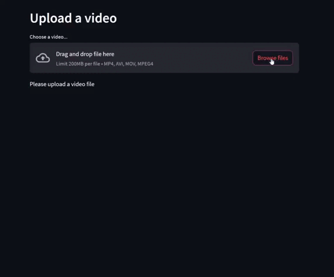

# deploy-onnx-model-with-streamlit-in-google-cloud
## [Yolov8](https://github.com/ultralytics/ultralytics) object detection [onnx](https://github.com/onnx/onnx) model deploy localhost and global(with [ngrok](https://ngrok.com/)) with [streamlit](https://github.com/streamlit/streamlit) in [google cloud](https://cloud.google.com/?hl=en)


# Installation
Clone the repository:
``` bash
git clone https://github.com/yahyoxonqwe/deploy-onnx-model-with-streamlit-in-google-cloud.git
```
Change into the project directory:
``` bash
cd deploy-onnx-model-with-streamlit-in-google-cloud
```
Install the required dependencies:
``` bash
pip install -r requirements.txt
```
Set your ngrok token : 
``` bash
ngrok config add-authtoken your_auth_token
```
## Deploy localhost and global (with ngrok)
``` bash
streamlit run stream.py --server.port 8666 & ngrok http 8666
```

## Demo
### time.sleep is used to buffer images due to slow internet speed




